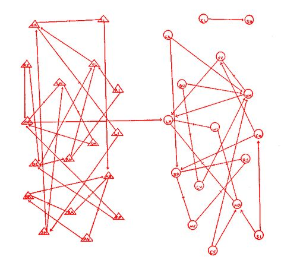

class: clear, title-slide, inverse, center, top, middle

# `r rmarkdown::metadata$title`
## `r rmarkdown::metadata$subtitle`
### `r rmarkdown::metadata$author`
### `r format(Sys.time(), "%B %d, %Y")`


```{r xaringan-panelset, echo=FALSE}
xaringanExtra::use_panelset()
```


---

# Ice Breaker: How do networks surprise you?

.pull-left[
## Share Your Story

Think of a moment when you felt most surprised by connections!

.font80[
**Consider sharing about:**
- A breakthrough moment in your research
- A time when collaboration clicked perfectly
- A moment of unexpected connection with students/colleagues]
]

.pull-right[
.center[


### .orange[My Chocolate Frog Moment]
.font70[*"I felt like Harry when I first saw my network visualizations come to life..."*]
]
]

???
Give participants 2-3 minutes to think, then share in pairs or small groups
Can also do this as a full group share if time permits


---
# Meet Your Instructor

.pull-left[
## Ela Castellanos-Reyes
###  .red[**Assistant Professor**] | NC State 

- Online learning pedagogy
- Social Network Analysis
- Instructional Design
- Learning Analytics

### Contact
📧 dcastel2@ncsu.edu  
🌐 [elacastellanosreyes.com](https://www.elacastellanosreyes.com)  
💼 [@ElaCR](https://www.linkedin.com/in/elacr)
]

.pull-right[
.center[

]


### About Me
.font90[My research interests include online interactions of adults and learners and identifying course design features that support online learners' social presence through social learning analytics.]

]

???
Speaker notes for yourself - these won't appear on the slide
---
class: clear, laser

.quote["From its earliest origins to it most recent applications to large-scale networks, social network analysis has reflected an **interdependency between theory and method.**"]

.author[~ Brian Carolan]


---
# Agenda

.pull-left[
## Part 1: Intro to SNA
- The **Four** Hallmarks of SNA
- Applications of SNA
- Discussion

]

.pull-right[

## Part 2: LASER Learning Labs
- Intro to SNA
- Network Measurement
- Groups & Egos
- Statistical Inference & Models
]


???
Notes for Ela


---

class: clear, inverse, center, middle

# Part 1: Intro to SNA
----

Hallmarks, Applications, and Discussion

---
# The Four Hallmarks of SNA

.panelset[

.panel[.panel-name[Relationships]

Social network analysis is based on .red[**ties**] connecting social .red[actors] (aka nodes, people) and is motivated by our intuition that relationships between individuals matter:

- no individual is an island, independence is .red[**NOT**] assumed
- .red[who] we know, are friends with, or talk with matters
- the influence of these relations is shaped by the larger network
- location in a social structure shapes one's opportunities and outcomes


<br>
.font80[[Freeman, L. (2004). The development of social network analysis.](https://www.researchgate.net/publication/239228599_The_Development_of_Social_Network_Analysis)]
]

.panel[.panel-name[Empirical Data]
It is firmly grounded in **systematic empirical data collection** using methods refined over decades and methods still evolving:

- observations of social context
- surveys and questionnaires 
- historical and administrative records
- digital learning tools and social networking sites

]

.panel[.panel-name[Graphical Imagery]

.pull-left[
It makes use of .red[**graphic imagery**] (graph theory) to represent actors and their relations with one another.

- Shapes for actors (nodes, vertices)
- Lines for relations (ties, edges, arcs)
]

.pull-right[.center[


.font80[.center[Moreno's 1930s elementary friendship network.]]
]
]Jacob Moreno 1930s friendship networks among elementary school students. 

]

.panel[.panel-name[Mathmatically Based]
It relies on the use of .red[**mathematical and/or computational models**] to succinctly represent the complexity of social life:
.pull-left[
### Network Statistics (Describe)
- Centrality
- Reciprocity
- Density, etc.

]

.pull-right[
### Inferential Models (Predict)
.font90[- .red[CONCOR]: CONvergence of iterated CORrelations
- .red[QAP]: Quadratric Assignment Procedue
- .red[ERGMs]: Exponential Random Graph Modesl
- .red[SAOM]: Stochastic Actor Oriented Models]

]
]


]

???

In social network analysis, CONCOR stands for CONvergence of iterated CORrelations. It is an algorithmic method used to partition a social network into groups, or “blocks,” of nodes that are structurally equivalent—meaning they have similar patterns of relationships with other nodes in the network.

QAP stands for Quadratic Assignment Procedure, which is a statistical method used in social network analysis. It’s a permutation test specifically designed to analyze dyadic data (data involving pairs of entities) while controlling for the non-independence that is inherent in network data.
The QAP works by “scrambling” or permuting the dependent variable data through several iterations to create multiple random datasets. This permutation approach creates a sampling distribution under the null hypothesis, allowing for statistical significance testing when traditional methods might be inappropriate due to the interdependence of observations in network data.


---
# Applications of SNA

.panelset[

.panel[.panel-name[Overview]
Interest in SNA as an alternative method for studying educational phenomena such has grown tremendously in the past few decades:

- Diffusion and adoption of innovations 
- Social influence 
- Belief systems 
- Social capital 
- Homophily 
- Efficacy of interventions 
- Small-group dynamics

]

.panel[.panel-name[Social Capital]
SNA provides a means to actually measure & model social capital and has be used to better understand:

- how social relations advantages some students (Maroulis and Gomez, 2008)
- dropout among Latino/a/ex students (Ream and Rumberger, 2008) 
- school-oriented friendship networks have the potential to reduce dropout rates
- parental social closure and student math achievement (Morgan and Todd, 2008)
]

.panel[.panel-name[Selection & Influence]
Educational researchers have used modeling of peer selection and influence to better understand: 

- who school leaders collaborate and confide in and why (Daly and Finnigan, 2010)
- how the characteristics of friends shape students’ aspirations and college attendance (Hallinan & Williams, 1990) 
- teachers’ attitudes toward school and district reforms (Cole & Weinbaum, 2010)


]

.panel[.panel-name[Diffusion]
Building on theories of diffusion, SNA has been used to explain how ideas and resources spread within and between networks of actors, such as: 

- attitudes and use of computers in classrooms over time (Frank et al., 2011)
- how substance abuse diffuses across adolescent networks (Valente et al., 2004)
- diffusion of charter school policy and creation across states (Renzulli and Roscigno, 2005)
]


]

---
# Discussion
Consider a social network of which you are a part. 
1. Who are the members or .red["actors"] in this network? 

1. What relationships or .red["ties"] connect these actors? 

1. Are there any groups or .red["cliques"] (aka groups) within this network?  

1. Are there any actors that .red["central"] to this network? 

---
class: clear, inverse, center, middle

# Part 2: SNA Learning Labs
----

Basic Concepts, Measurement, Groups, and Model

---
# SNA Lab 1: Network Analysis for Newbies


.pull-left[
### Intro Presentation 
- [Conceptual Overview](https://elacreyes.github.io/network-analysis-2025-Summer/module-1/sna-1-conceptual-overview.html)
- [Code Along Slides](https://elacreyes.github.io/network-analysis-2025-Summer/module-1/sna-1-code-along-R.html) & [.qmd File](https://github.com/ElaCReyes/network-analysis-2025-Summer/blob/main/module-1/sna-1-code-along-R.qmd)


### Essential Readings

- [Ch 1: The Social Network Perspective](https://drive.google.com/open?id=1cmfX3HwEbPC0_1vDp2nBsFlJpcErTqMm&usp=drive_fs)

- [Ch 2: Historical, Theoretical, and Analytical Foundations](https://drive.google.com/open?id=1cmfX3HwEbPC0_1vDp2nBsFlJpcErTqMm&usp=drive_fs)  

- [Ch 3: Basic Concepts](https://drive.google.com/open?id=1cmfX3HwEbPC0_1vDp2nBsFlJpcErTqMm&usp=drive_fs)  

] 

.pull-right[

### Case Study
.font70[
- [SNA Case Study: Who's Friends with Who in Middle School? .qmd (Quarto) File](https://github.com/ElaCReyes/network-analysis-2025-Summer/blob/main/module-1/sna-1-case-study-R.qmd) You may use Posit or Download the file and work in RStudio
- [SNA Case Study - KEY](https://elacreyes.github.io/network-analysis-2025-Summer/module-1/sna-1-case-study-key-R.html) Open in case of emergency :)

- [Guiding Study Pittinsky & Carolan (2008): Behavioral versus cognitive classroom friendship networks.](https://drive.google.com/open?id=1cmfX3HwEbPC0_1vDp2nBsFlJpcErTqMm&usp=drive_fs)
]

.font70[
### Learning Lab 1 Badge
- [Intro to SNA](https://elacreyes.github.io/network-analysis-2025-Summer/module-1/sna-1-badge.html) 

]

]
---
# SNA Lab 2: Data Management & Measurement


.pull-left[
### Intro Presentation 
- [Conceptual Overview](https://elacreyes.github.io/network-analysis-2025-Summer/module-2/sna-2-conceptual-overview.html)
- [Code Along Slides](https://elacreyes.github.io/network-analysis-2025-Summer/module-2/sna-2-code-along-R.html) & [.qmd File](https://github.com/ElaCReyes/network-analysis-2025-Summer/blob/main/module-2/sna-2-code-along-R.qmd)


### Essential Readings

- [Ch 4: Collecting and Managing Network Data](https://drive.google.com/open?id=1cmfX3HwEbPC0_1vDp2nBsFlJpcErTqMm&usp=drive_fs)

- [Ch 5: Structural Measures for Complete Networks](https://drive.google.com/open?id=1cmfX3HwEbPC0_1vDp2nBsFlJpcErTqMm&usp=drive_fs)  
]

.pull-right[
### Case Study

- [SNA Case Study: A Tale of Two MOOCs - KEY](https://elacreyes.github.io/network-analysis-2025-Summer/module-2/sna-2-case-study-key-R.html)


- [Kellog & Edelman (2015) Guiding Study: Massively Open Online Course for Educators (MOOC-Ed) network dataset](https://bera-journals.onlinelibrary.wiley.com/doi/abs/10.1111/bjet.12312)

### Learning Lab 2 Badge
- [Network Measurement](https://elacreyes.github.io/network-analysis-2025-Summer/module-2/sna-lab-2-badge.html)

]

---
# SNA Lab 3: Group & Egocentric Analysis

.pull-left[
### Intro Presentation 
- [Conceptual Overview](https://elacreyes.github.io/network-analysis-2025-Summer/module-3/sna-3-conceptual-overview.html)
- [Code-Along](https://elacreyes.github.io/network-analysis-2025-Summer/module-3/sna-3-code-along-R.html)

### Essential Readings

- [Ch 6: Groups and Positions in Complete Networks](https://drive.google.com/open?id=1cmfX3HwEbPC0_1vDp2nBsFlJpcErTqMm&usp=drive_fs)

- [Ch 7: Measures for Egocentric Network Analysis](https://drive.google.com/open?id=1cmfX3HwEbPC0_1vDp2nBsFlJpcErTqMm&usp=drive_fs)  
] 

.pull-right[

### Case Study

- [SNA Case Study: Components, Cliques, & Key Actors - KEY](https://elacreyes.github.io/network-analysis-2025-Summer/module-3/sna-lab-3-case-study-key.html)


- [Guiding Study: Hashtag Common Core](https://www.hashtagcommoncore.com)

### Learning Lab 3 Badge
- [Groups & Egos](https://elacreyes.github.io/network-analysis-2025-Summer/module-3/sna-lab-3-badge.html)

]

---
# SNA Lab 4: Inference & Modeling 


.pull-left[
### Intro Presentation 
- [Conceptual Overview](https://elacreyes.github.io/network-analysis-2025-Summer/module-4/sna-4-conceptual-overview.html)
- [Code-Along](https://elacreyes.github.io/network-analysis-2025-Summer/module-4/sna-4-code-along-R.html)


### Essential Readings

- [Ch 8: Statistical Inference With Network Data](https://drive.google.com/open?id=1cmfX3HwEbPC0_1vDp2nBsFlJpcErTqMm&usp=drive_fs)

- [Ch 9: Network Data and Statistical Models](https://drive.google.com/open?id=1cmfX3HwEbPC0_1vDp2nBsFlJpcErTqMm&usp=drive_fs)  
] 

.pull-right[

### Case Study

- [SNA Case Study: Birds of a Feather Lead Together - KEY](https://elacreyes.github.io/network-analysis-2025-Summer/module-4/sna-lab-4-case-study-key.html)

- [Guiding Study: The ebb and flow of social network ties between district leaders.](https://drive.google.com/open?id=1cmfX3HwEbPC0_1vDp2nBsFlJpcErTqMm&usp=drive_fs)
]

### Learning Lab 4 Badge
- [Models & Inference](https://elacreyes.github.io/network-analysis-2025-Summer/module-4/sna-lab-4-badge.html)

---
class: clear, center

## .font130[.center[**Thank you!**]]


.center[<br/>**Ela Castellanos-Reyes**<br/><mailto:dcastel2@ncsu.edu>]

.pull-left-narrow[.center[ ]]

.pull-right-wide[
.left[.font70[
This work was supported by the National Science Foundation grant DRL-2025090 (ECR:BCSER). Any opinions, findings, and conclusions expressed in this material are those of the authors and do not necessarily reflect the views of the National Science Foundation.
]]]


